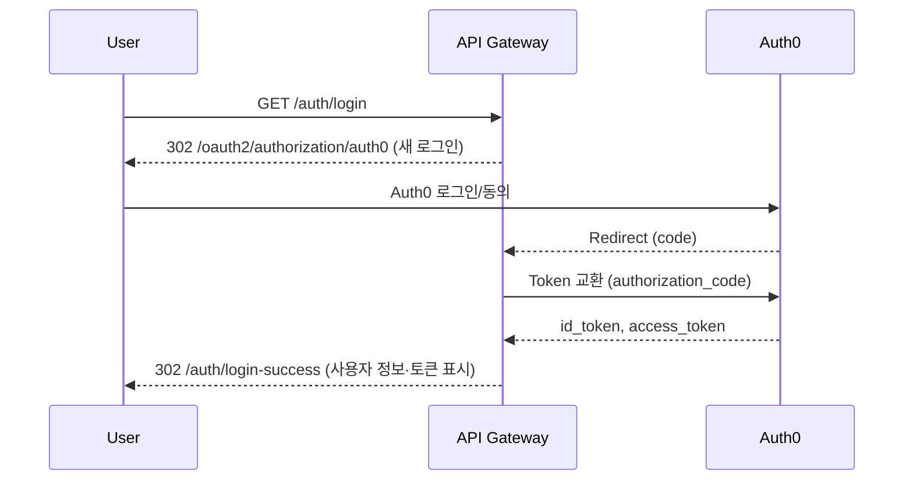

## API 게이트웨이 아키텍처·구현 가이드 (Spring Cloud Gateway + Auth0)

이 문서는 현재 API 게이트웨이의 기능, 구현 목표, 구현 방법, 그리고 요청 처리 흐름을 한곳에 정리한 가이드입니다. Auth0 기반 인증, Spring Cloud Gateway 라우팅/필터, Redis Rate Limiting, Resilience4j Circuit Breaker, Kafka 로깅, 표준 에러 응답 등 전체 구성을 포괄합니다.

### 주요 목표
- 일관된 인증/인가(Authorization)와 서비스 라우팅을 제공
- 장애 격리(Circuit Breaker), Rate Limiting 등 운영 보호장치 내장
- 표준화된 응답과 구조화 로깅으로 관측성(Observability) 강화
- 보안 기본값(CORS, 헤더 제거, 민감정보 마스킹) 준수

### 기술 스택
- Spring Boot 3 + Spring Cloud Gateway (WebFlux)
- Auth0 (OIDC/OAuth2, JWT Resource Server)
- Redis (Rate Limiting·로그인 시도 추적·차단 상태)
- Resilience4j (Circuit Breaker)
- Kafka (게이트웨이 액세스 로그 이벤트)
- springdoc-openapi (Swagger UI)

---

## 전체 아키텍처

```mermaid
flowchart LR
  Client["클라이언트"] -->|HTTP| GW{{"API Gateway"}}
  subgraph GWStack[Gateway Stack]
    direction TB
    RIF[RequestIdFilter] --> BCF[BlockCheckFilter]
    BCF --> SEC[Spring Security (JWT/OAuth2 Login)]
    SEC --> GWF[Gateway Filters]
    GWF --> SRF[StandardResponseFilter]
    SRF --> RLF[RateLimitHeadersFilter]
  end
  GW --> Downstreams["다운스트림 마이크로서비스"]
  GW -. Kafka .-> K[Kafka logs.gateway]
  GW -. Redis .-> R[(Redis)]
```

- RequestIdFilter: `X-Request-ID` 생성·전파 (`src/main/java/org/example/APIGatewaySvc/filter/RequestIdFilter.java`)
- BlockCheckFilter: Redis 차단 목록 검사 (IP/사용자/API 키) (`filter/BlockCheckFilter.java`)
- Spring Security: Auth0 JWT 검증·권한 추출 + OAuth2 Login (`config/SecurityConfig.java`)
- Gateway Filters: 로깅/응답 표준화/RateLimit 헤더 등 (`filter/*`)
- Kafka: 요청 시작/종료/에러 로깅 (`service/GatewayLogService.java`)
- Redis: Rate Limiting, 로그인 시도 추적, 차단 상태 저장 (`config/RedisConfig.java`)

---

## 인증/인가 (Auth0 + Resource Server)

### 구성 요소
- `config/SecurityConfig.java`
  - Resource Server: Auth0 JWKS로 JWT 서명 검증, `AudienceValidator`로 `aud` 검증
  - 권한 매핑: `permissions` → 무접두사, `roles` → `ROLE_*`
  - 공개 경로: `/auth/**`, `/public/**`, `/actuator/**`, Swagger 등
  - OAuth2 Login: `/auth/login` 시작 → Auth0 인증 → `/auth/login-success`로 리다이렉트
  - OIDC 로그아웃: `/auth/logout` → Auth0 로그아웃 → `logoutRedirectUri`로 이동

- `security/AudienceValidator.java`: `aud`(audience) 클레임 검증
- `config/TestJwtConfig.java`: 로컬 `jwt.test-mode=true` 시 HS256 테스트 토큰 허용
- 컨트롤러
  - `controller/AuthController.java`: 로그인/로그아웃/성공/오류/유저정보·클라이언트용 Auth0 설정 노출
  - `controller/JwtTokenController.java`: 개발용 테스트 토큰 생성(옵션, `jwt.test-mode=true`에서만)

### 로그인 플로우 (브라우저)


### 토큰 기반 호출 (머신투머신/SPA)
- Authorization: `Bearer {JWT}` 로 `/api/**`, `/gateway/**` 등 보호 경로 접근
- JWT 요구사항: 유효 서명(RS256), 올바른 `iss`(issuer), 필수 `aud`(AudienceValidator 통과)

### 필수 프로퍼티 (예시)
- `auth0.issuerUri` (예: `https://{tenant}.auth0.com/`)
- `auth0.audience` (Auth0 API Identifier)
- `spring.security.oauth2.client.registration.auth0.*` (OIDC 로그인용)
- `spring.security.oauth2.resourceserver.jwt.issuer-uri` (리소스 서버 검증용)

주의: 운영 환경에서는 모든 자격정보를 환경변수/시크릿으로 주입하세요. 레포에 비밀키를 커밋하지 않습니다.

---

## 라우팅·CORS·기본 필터 (application.yml)

- 전역 CORS: `http://localhost:3000`, `http://localhost:8080` 허용, `allowCredentials: true`
- 기본 필터: `Retry`, `AddRequestHeader=X-Gateway`, `TokenRelay`, `RemoveRequestHeader=Cookie`, `StandardResponseFilter`
- 대표 라우트 (로컬)
  - `/api/**` → `http://localhost:8081` (보호 리소스)
  - `/api/users/**` → `http://localhost:8081` (local profile)
  - `/public/**` → `http://localhost:8082` (공용 리소스)

실제 라우팅은 `src/main/resources/application.yml`의 프로필에 정의되어 있으며, 동적 라우팅 샘플은 `config/GatewayRoutesConfig.java`(주석) 참고.

---

## 게이트웨이 필터 체인

### 요청 식별·로깅
- `filter/RequestIdFilter.java` (Order -100)
  - 요청마다 `X-Request-ID` 생성·응답 헤더 삽입, Reactor Context/SLF4J MDC 전파

- `filter/GatewayLoggingFilter.java`
  - 요청 시작/종료/에러 이벤트를 Kafka `logs.gateway`로 비동기 전송
  - 민감정보 마스킹: `util/SecurityMaskingUtil.java`
  - 서비스·라우트·IP·User-Agent 등 메타 수집

### 보안·차단
- `filter/BlockCheckFilter.java` (Ordered.HIGHEST_PRECEDENCE)
  - Redis 키 `blocked:ip:*`, `blocked:user:*`, `blocked:key:*` 조회 → 차단 시 403 JSON 응답
  - `service/BlockService.java`로 차단·해제·조회 구현

- `filter/LoginAttemptTrackingFilter.java`
  - 401 응답을 인증 실패로 간주하여 `service/LoginAttemptService.java`에 실패 기록
  - 사용자 5회·IP 10회 실패 시 30분 자동 차단, 성공 시 자동 리셋

### 응답 표준화·RateLimit 헤더
- `filter/StandardResponseFilter.java`
  - JSON 응답을 표준 DTO(`dto/StandardResponseDTO.java`)로 래핑
  - 성공/에러에 따라 `util/ErrorCodeMapper.java`로 코드·메시지 매핑, 메타(`requestId`, `durationMs`) 포함
  - 바이너리 응답은 래핑 제외

- `filter/RateLimitHeadersFilter.java`
  - Redis의 Rate Limiter 상태에서 `X-RateLimit-*` 헤더 추가 (limit/remaining/reset)

---

## Rate Limiting (Redis)

- 구성
  - `config/RedisConfig.java`: Reactive Redis 연결/템플릿
  - `config/RateLimitConfig.java`: 서비스별 `RedisRateLimiter` 빈
  - `config/KeyResolverConfig.java`: 우선 `user:{sub}` → 없으면 `ip:{client-ip}` 키 생성

- YAML 예시 (라우트 필터에서 사용)
```yaml
spring:
  cloud:
    gateway:
      routes:
        - id: some-service
          uri: http://localhost:808x
          predicates:
            - Path=/gateway/some/**
          filters:
            - name: RequestRateLimiter
              args:
                rate-limiter: "#{@userServiceRateLimiter}"
                key-resolver: "#{@userKeyResolver}"
                deny-empty-key: false
```

주의: 현재 일부 라우트에서 Rate Limiter 필터는 주석 처리되어 있으며, 필요 시 활성화합니다.

---

## Circuit Breaker (Resilience4j)

- 설정: `application.yml`의 `resilience4j.circuitbreaker.*`
- 기본값: 슬라이딩 20, 최소호출 10, 실패율 50%, OPEN 10s, 느린호출 3s(서비스별 조정)
- Fallback: `controller/FallbackController.java`가 RFC 7807 Problem Details로 503 응답 작성

---

## 에러 처리 표준화 (RFC 7807)

- 전역 핸들러: `exception/GlobalErrorWebExceptionHandler.java`
  - 인증(401)·권한(403)·라우팅 실패·레이트리밋(429)·외부 의존성(503) 등 유형별 처리
  - `util/ProblemDetailsUtil.java`로 표준 `application/problem+json` 생성, `X-Request-ID` 포함

예시 401 응답
```json
{
  "type": "about:blank",
  "title": "Authentication failed",
  "status": 401,
  "detail": "Invalid or expired JWT token",
  "instance": "<requestId>",
  "timestamp": "2024-01-01T00:00:00Z"
}
```

---

## 관측성·문서화

- Actuator: `/actuator/health`, `/actuator/gateway/routes`, `/actuator/prometheus`, `/actuator/circuitbreakers`
- Swagger UI: `/swagger-ui.html` (`config/OpenApiConfig.java`)
- 로깅: `gateway.logging.*` 설정으로 Kafka 전송 제어·민감정보 마스킹

---

## 환경 변수·설정

권장 환경 변수 (예시)
```bash
# Auth0
AUTH0_ISSUER_URI=https://your-tenant.auth0.com/
AUTH0_AUDIENCE=https://api.your-service.com
AUTH0_CLIENT_ID=xxxxx
AUTH0_CLIENT_SECRET=xxxxx

# Redis / Kafka / Server
SPRING_REDIS_HOST=localhost
SPRING_REDIS_PORT=6379
KAFKA_BOOTSTRAP_SERVERS=localhost:9092
SERVER_PORT=8080

# 로컬 개발 시
SPRING_PROFILES_ACTIVE=local
# (옵션) 테스트 토큰 모드 사용
JWT_TEST_MODE=true
```

설정 참조: `src/main/resources/application.yml`

---

## 로컬 실행·테스트

1) Redis/Kafka 준비 (필요 시 Docker)
```bash
docker run -d --name redis -p 6379:6379 redis:alpine
```

2) 애플리케이션 실행
```bash
./gradlew bootRun
```

3) 헬스·예시 호출
```bash
curl http://localhost:8080/public/health
curl -H "Authorization: Bearer {JWT}" http://localhost:8080/api/users/profile
```

4) Swagger
- `http://localhost:8080/swagger-ui.html`

---

## 운영 고려사항
- 비밀정보는 반드시 환경변수/시크릿 관리. 레포에 커밋 금지
- CORS origin을 명시적으로 관리, `allowCredentials=true`일 때 와일드카드 금지
- JWKS 네트워크 장애 대비 Circuit Breaker·타임아웃 유지
- Rate Limiting 키 전략: 사용자 우선 → 익명은 IP. 프록시 환경의 신뢰 가능한 헤더만 사용
- 표준 응답 래핑 제외 경로: `/auth/**`, `/public/**`, `/actuator/**`, Swagger, 바이너리 응답

---

## 확장 가이드 (새 서비스 추가)
1) 라우트 추가 (`application.yml`)
```yaml
spring:
  cloud:
    gateway:
      routes:
        - id: inventory-service
          uri: http://localhost:8090
          predicates:
            - Path=/api/inventory/**
          filters:
            - UserInfoHeader
            - name: RequestRateLimiter
              args:
                rate-limiter: "#{@managementServiceRateLimiter}"
                key-resolver: "#{@userKeyResolver}"
                deny-empty-key: false
            - name: CircuitBreaker
              args:
                name: inventorySvcCb
                fallback-uri: forward:/fallback/service-unavailable
```

2) 필요 시 OpenAPI 노출·모니터링 경로 허용
3) 서비스별 Rate Limit/Circuit Breaker 파라미터 조정

---

## 참고
- 코드: `src/main/java/org/example/APIGatewaySvc/**`
- 문서: `README.md`, `FEATURES-GUIDE.md`

본 가이드는 현재 레포의 실제 구현을 기준으로 작성되었습니다. 운영 환경에서는 보안·성능·가용성 요구사항에 맞춰 프로퍼티와 인프라 구성을 조정하세요.


