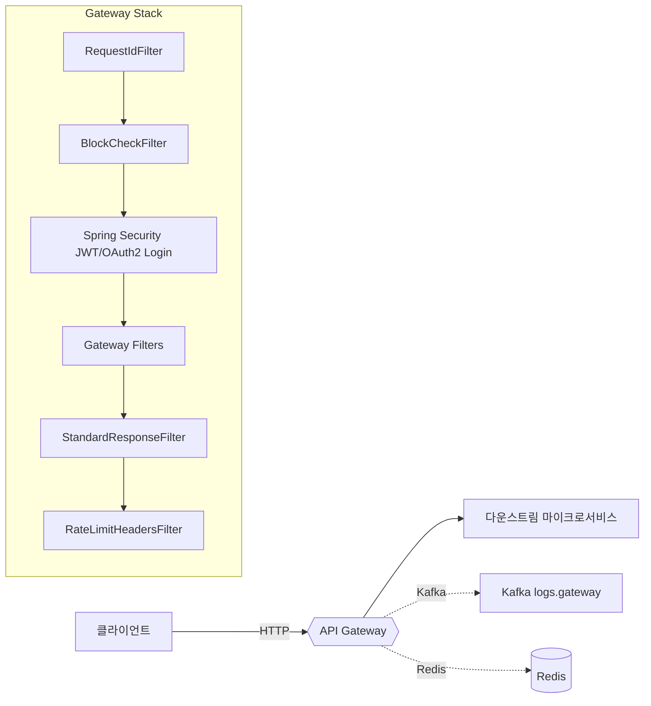

# API Gateway 구현 로드맵 및 현황 분석

## 📋 현재 구현 상태 개요

본 API Gateway는 제시된 기본 아키텍처를 완전히 포함하며, 실제 프로덕션 환경에 필요한 엔터프라이즈급 기능들까지 구현된 고도화된 상태입니다.

## ✅ 완전히 구현된 핵심 기능들

### 기본 아키텍처 요소
- **Spring Cloud Gateway + Auth0 JWT**: 완벽하게 구현
- **JWT 인증**: AudienceValidator, OIDC 로그인/로그아웃 포함
- **TokenRelay**: 글로벌 필터로 설정되어 JWT를 다운스트림 서비스로 전달
- **라우팅**: 5개 마이크로서비스 라우팅 완료
  - User Service (`/gateway/users/**`)
  - API Management Service (`/gateway/apimgmt/**`)
  - Custom API Management Service (`/gateway/customapi/**`)
  - AI Feature Service (`/gateway/aifeature/**`)
  - System Management Service (`/gateway/sysmgmt/**`)

### 엔터프라이즈급 추가 기능들
- **Redis 기반 Rate Limiting**: 사용자별/IP별 요청 제한
- **Resilience4j Circuit Breaker**: 서비스별 장애 격리
- **Kafka 로깅 시스템**: 구조화된 게이트웨이 로깅
- **IP/사용자/API키 차단 시스템**: 보안 차단 기능
- **로그인 시도 추적 및 자동 차단**: 브루트포스 방어
- **RFC 7807 표준 에러 응답**: 일관된 에러 처리
- **민감정보 마스킹**: 로그 보안 강화
- **Prometheus 메트릭**: 운영 모니터링
- **Request ID 추적**: 분산 환경에서 요청 추적

## 🔍 현재 vs 제시된 아키텍처 비교

### 제시된 기본 아키텍처
```mermaid
graph TD
    subgraph Client
        A[Browser or SPA] -->|HTTP Request| B(API Gateway)
    end
    subgraph API Gateway
        direction LR
        B --> C{필터 체인}
        C --> D[JWT 인증 (Spring Security)]
        D --> F[라우팅]
    end
    F --> G[다운스트림 서비스]
```

### 현재 구현된 고도화된 아키텍처


## 🎯 향후 구현 로드맵

### Phase 1: 기존 기능 일관성 확보 ⚡ (즉시 시작 가능)

**목표**: 현재 구현된 기능들의 일관성과 안정성 확보

#### 1.1 CORS 설정 통합
- **현재 상태**: 테스트 설정과 메인 설정 간 불일치 존재
- **작업 내용**:
  - 메인 `application.yml`에 CORS 글로벌 설정 추가
  - 테스트 환경과 프로덕션 환경 CORS 정책 일관성 확보
  - `allowCredentials: true` 설정 시 와일드카드 제거

#### 1.2 경로 구조 표준화
- **현재 상태**: `/gateway/**` 경로 사용 중, 일부 문서에서 `/api/v1/**` 언급
- **작업 내용**:
  - API 경로 구조 일관성 확보 (`/gateway/**` 로 일관적)
    예) /gateway/users/api/users -> /api/users로 라우팅팅
  - 문서와 실제 구현 간 일치성 확보
  - 버전 관리 전략 수립

#### 1.3 설정 검증 및 최적화
- **작업 내용**:
  - Auth0 연결 상태 및 설정 검증
  - Redis 연결 풀 최적화
  - Kafka 프로듀서/컨슈머 설정 검증
  - 환경별 설정 분리 및 검증

#### 1.4 테스트 커버리지 점검
- **작업 내용**:
  - 누락된 통합 테스트 케이스 식별 및 추가
  - 필터 체인 테스트 강화
  - 에러 시나리오 테스트 보완

### Phase 2: 관측성 및 운영성 강화 🔍 (1-2주 후)

**목표**: 운영 환경에서의 모니터링 및 디버깅 능력 향상

#### 2.1 분산 추적 시스템 강화
- **현재 상태**: Request ID 기반 기본 추적 구현
- **개선 사항**:
  - Zipkin/Jaeger 연동으로 분산 추적 가시성 향상
  - 마이크로서비스 간 호출 추적 강화
  - 성능 병목 지점 식별 기능

#### 2.2 메트릭 확장
- **현재 상태**: 기본 Prometheus 메트릭 제공
- **개선 사항**:
  - 비즈니스 메트릭 추가 (사용자별 API 호출 통계)
  - SLA 모니터링 메트릭 (응답 시간, 가용성)
  - 커스텀 대시보드 구성

#### 2.3 동적 라우팅 지원
- **현재 상태**: YAML 기반 정적 라우팅
- **개선 사항**:
  - `GatewayRoutesConfig` 활성화로 런타임 라우팅 변경 지원
  - 관리 API를 통한 라우팅 규칙 동적 추가/수정
  - A/B 테스팅 및 카나리 배포 지원

#### 2.4 알림 시스템 구축
- **작업 내용**:
  - Circuit Breaker 상태 변경 알림
  - Rate Limit 임계치 초과 알림
  - 시스템 장애 조기 경보 시스템

### Phase 3: 개발자 경험 개선 👨‍💻 (필요시)

**목표**: 개발팀의 생산성 향상 및 디버깅 효율성 증대

#### 3.1 관리 도구 개발
- **API Gateway 관리 UI**:
  - 실시간 라우팅 상태 모니터링
  - 필터 체인 시각화
  - 실시간 로그 스트리밍

#### 3.3 문서화 강화
- **작업 내용**:
  - API 사용 가이드 작성
  - 트러블슈팅 매뉴얼 작성
  - 아키텍처 결정 기록(ADR) 작성

#### 3.4 로컬 개발 환경 최적화
- **작업 내용**:
  - Hot-reload 기능 강화
  - 개발자 친화적 설정 제공
  - Docker Compose 기반 통합 개발 환경

### Phase 4: 고급 기능 확장 🚀 (장기 로드맵)

**목표**: 차세대 API Gateway 기능 구현

#### 4.1 API 라이프사이클 관리
- **API 버전 관리**:
  - Semantic versioning 지원
  - 하위 호환성 관리
  - 점진적 마이그레이션 지원

#### 4.2 고급 보안 기능
- **WAF (Web Application Firewall)** 통합
- **DDoS 방어** 메커니즘
- **API 스펙 검증** (OpenAPI 3.0 기반)
- **API 키 관리** 시스템

#### 4.3 멀티 테넌트 지원
- **테넌트별 격리**
- **테넌트별 정책 관리**
- **리소스 할당량 관리**


## 📊 구현 우선순위 매트릭스

| Phase | 난이도 | 비즈니스 가치 | 기술적 부채 해결 | 추천 우선순위 |
|-------|--------|---------------|------------------|---------------|
| Phase 1 | 낮음 | 높음 | 높음 | ⭐⭐⭐⭐⭐ |
| Phase 2 | 중간 | 높음 | 중간 | ⭐⭐⭐⭐ |
| Phase 3 | 중간 | 중간 | 낮음 | ⭐⭐⭐ |
| Phase 4 | 높음 | 높음 | 낮음 | ⭐⭐ |

## 🎯 권장 시작점

1. **즉시 시작**: Phase 1의 CORS 설정 통합 및 경로 구조 표준화
2. **단기 목표**: Phase 1 완료 후 Phase 2의 분산 추적 강화
3. **중장기 목표**: 비즈니스 요구사항에 따라 Phase 3, 4 선택적 구현

## 💡 결론

현재 구현된 API Gateway는 제시된 기본 아키텍처를 완전히 포함하며, 실제 프로덕션 환경에서 필요한 고급 기능들까지 구현되어 있는 매우 완성도 높은 상태입니다.

**우선순위가 높은 Phase 1부터 시작하여 점진적으로 개선해 나가면, 이미 훌륭한 기반 위에 더욱 견고하고 운영 친화적인 API Gateway를 구축할 수 있을 것입니다.**

---

*본 문서는 현재 구현 상태를 기반으로 작성되었으며, 비즈니스 요구사항 변화에 따라 우선순위가 조정될 수 있습니다.*